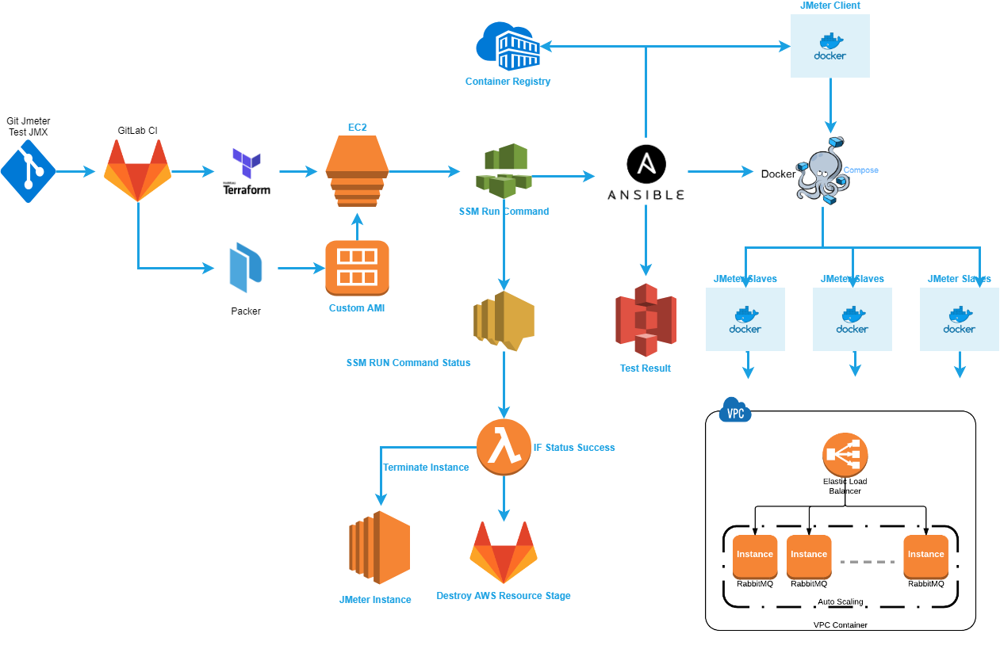
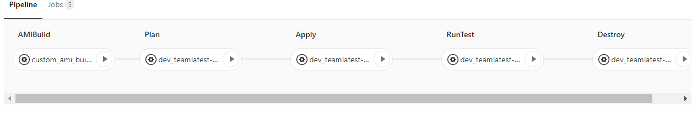
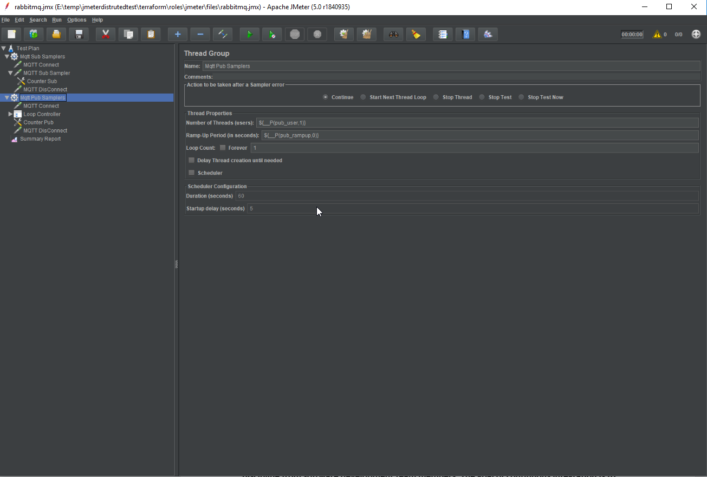
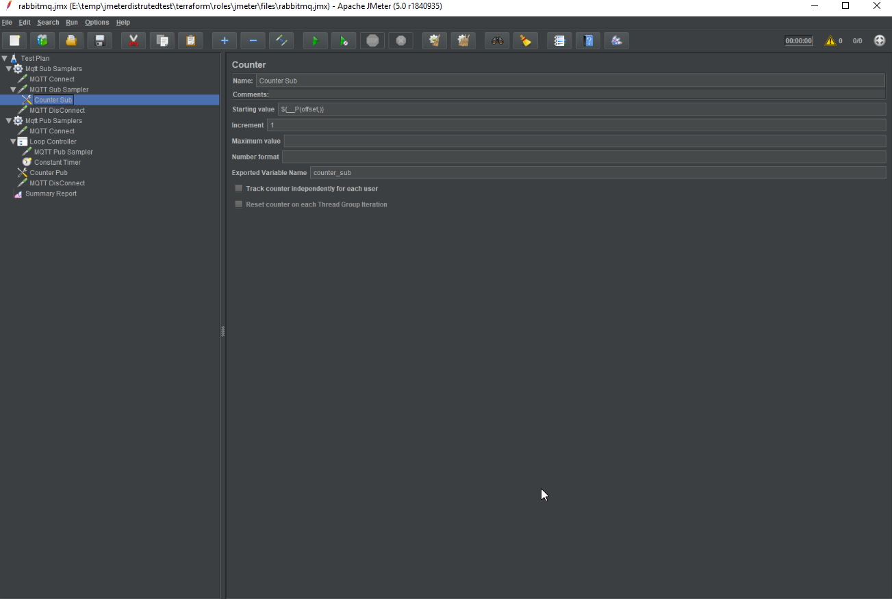
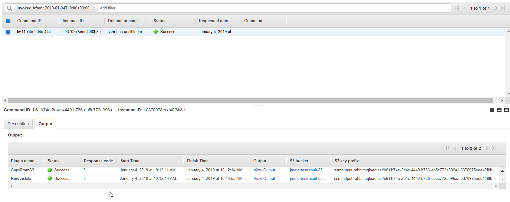
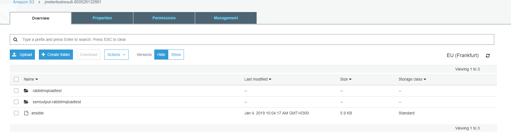
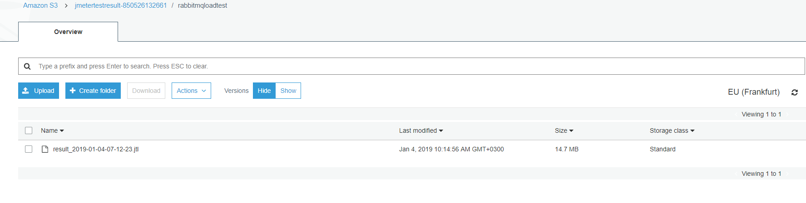

## JMETER Distribution Test

In This project I have automate jmeter distribution test using Gitlab CI pipeline.The pipeline provide us to create custom AMI that is build from Packer so if you need to extra customize AMI you can create your own one changing Packer template and use it any where like JMeter or another usecase.
In this project I used to below tools

- Terraform to build test infrastructure on AWS Cloud Environment.
- AWS Services = EC2,SSM,S3,Lambda
- Packer create New Custom AMI
- Ansible customize EC2 test environment and manage dockerize jmeter application.
- Docker and Docker-Compose


In this project we are using GitLab CI to create and update and destroy test infrastructure.The different of this project jmeter cluster client and slave instances are docker container and  slaves are running with docker-compose, jmeter client execute with docker run command via ansible docker_container module.

My test case is RabbitMQ Broker Cluster Performance for MQTT Pub/Sub using JMeter Distribution.So I have customize my jmeter container to my requirement for example  added mqtt plugin.So In this way you can customize your jmeter environment to changing Dockerfile. 

Below diagram show you to Jmeter Distributed Test Automation.My terraform code as below will be modified by yourself to correspond requirement.

This automation serving our test and development team so below diagram is formed according to our needs so you can add or change any step for your needed.

 #### JMeter Distribution Test Architectural Design
 
 

```yaml
vpcsecuritygroupid = ["sg"]

environment = "jmeter"


bucket = "bucket_name"
project = "keyprefix"
```

Jmeter client dockerize, JMeter slaves docker compose,docker network create, jmeter image build and push to the registry, run JMeter test and send result to the bucket.All operation doing by Ansible and Ansible Jmeter role tree as below


 
 ``` bash
.
├── defaults
│   └── main.yml
├── files
│   └── test.jmx
├── handlers
│   └── main.yml
├── meta
│   └── main.yml
├── tasks
│   ├── docker.yml
│   ├── main.yml
│   ├── prepare.yml
│   └── s3.yml
├── templates
│   └── docker-compose.yml.j2
├── tests
│   └── inventory
└── vars
    └── main.yml


 ```

From hero to zero operation doing by below Gitlab CI pipeline.

After you prepare your own JMX file as mention above you can push your code to the GitRepo and there is creating new pipeline for execution.

##### How to system works.

    1. Create Custom AMI by Packer
    2. Plan to AWS Resource Creation before apply by Terraform.
    3. Apply to Create all AWS Resources by Terraform.
    4. RunTest execute SSM Run Command on created instances then run all jmeter container and other execution by Ansible.
    5. Destroy All AWS Resource by Terraform


 
 #### JMeter Distributed Test Gitlab CI Pipeline 
 
 
 
 Cloud layered Resources Like AMI and other Amazon Services and Resources are created by Packer and Terraform.
 
 Packer build AMI with tag `Name=JMeterAMI` so below terraform code get most recent ami with tag `Name=JMeterAMI` finally we are using each time with most recent updated JMeterAMI by Packer
 
 ```HCL
 
  data "aws_ami" "jmeterami" {
    most_recent      = true
    owners = ["850526132661"]
    filter {
      name   = "tag:Name"
      values = ["JMeterAMI"]
    }
    
  }
  
  ```
 
 JMETER SLAVE Instances Docker-Compose YAML as below that is referenced by 
 
 https://www.blazemeter.com/blog/jmeter-distributed-testing-with-docker
 [BlazerMeter](https://www.blazemeter.com/blog/jmeter-distributed-testing-with-docker)
 
 JMeter Client GUI parameter  pass to the specific slave such as sub_user, pub_user  parameters etc.
 
 Docker Compose YAML would be generated Ansible playbook using Jinja2 Template file as below content.The Jmeter Slaves are dockerize using docker-compose so slave instances are defined under vars/main.yml
 
Docker Compose YAML
```yaml

version: '3'

services:

  {{ slave.name }}:
    image: {{ dockerrepository }}:{{ imagetag }}
    volumes:
    - {{ volume_from_mount }}:{{ volume_to_mount }}
    command: -s -n -Jclient.rmi.localport=7000 -Jserver.rmi.localport=60000 -Jserver.rmi.ssl.disable=true -Joffset={{ slave.offset }}



```
Above Compose YAML using below varible set.Names are the slaves names and offsets are de offset variable for the Jmeter Slave properties.

If the offsets was not defined docker-compose yaml still will be generate sucessfully with intended variables.But if you define more than varible like offset you have to small change docker-compose.yml.j2 file and vars/main.yml that is provided variable values to the jinja2 template as your requirement.   

``` yaml

slaves:
- name: slave-1
  offset: 0
- name: slave-2
  offset: 1000
- name: slave-3
  offset: 2000
- name: slave-4
  offset: 3000
- name: slave-5
  offset: 4000
- name: slave-6
  offset: 5000
- name: slave-7
  offset: 6000
- name: slave-8
  offset: 7000
- name: slave-9
  offset: 8000
- name: slave-10
  offset: 9000


``` 
 In Our Test Case I have to prepare my Jmeter JMX file you can see below screenshots
#### JMeter Client Gui Configuration


#### JMeter Client Gui Configuration


In This Example JMX Test File under `terraform/roles/files/test.jmx` In each test you have to prepare your own JMX file and replace content of the test.jmx file.Push it to the repository


JMeter Client container without GUI execution by Ansible docker_container module as below.

  
 ``` bash
tasks
├── tasks/docker.yml
├── tasks/main.yml
├── tasks/prepare.yml
└── tasks/s3.yml

```
 
Below part of docker.yml is jmeter client execution with desired varible.You can customize added needed exstra varible to run jmeter client using defaults/main.yml file
 
 ``` yaml
 
- name: Run Jmeter Docker Both Master and Slave
  docker_container:
      name: jmeterclient
      network_mode: jmeter_default
      networks:
         - name: jmeter_default
      image: emregundogdu/jmeter:v6
      volumes:
            - "{{volume_from_mount}}:{{volume_to_mount}}"
      command: 
        - "-n -X -Jclient.rmi.localport=7000 -Jserver.rmi.ssl.disable=true"
        - "-R {{ slave }}{{ slave }},"
        - "-t {{ volume_to_mount}}/test.jmx"
        - "-l {{ volume_to_mount}}/tmp/result_{{ timestamp }}.jtl"
        - "-j {{ volume_to_mount}}/tmp/jmeter_{{ timestamp }}.log"
        - "-Gsub_user={{ sub_user }} -Gpub_user={{ pub_user }} -Gpub_payload_length={{ pub_payload_length }} -Gpub_loop={{ pub_loop }}"
 ```
After that This roles executed with SSM trigger via Gitlab CI stage if you do not use Gitlab CI or any CI/CD tool you can execute role with manually below command.

Packer Default upload this role to the /opt/jmeter/roles directory and test.yml call to this roles as below.

``` yaml

- hosts: localhost
  become: true
  roles:
  - role: /opt/jmeter/roles/jmeter
    vars:
      bucket: '<bucket_name>'
      keyprefix: 'rabbitmqloadtest'
      
```
You can execute ansible role with manually as below command line or using any CICD tool with trigger pipeline.

ansible-playbook /opt/jmeter/roles/test.yml --extra-vars='bucket=${var.bucket} keyprefix=${var.project}'

In Terraform change keyprefix variable to diversity for each developer and tester to get his/her own test result in different folder at same bucket. 

I am using Gitlab CI pipeline and AWS SSM Document which download my jmeter role and run ansible-playbook to my role as described above.After click RunTest stage you can look at AWS SSM Run Command Dashboard and check if the run command finished successfully as shown below screenshot

#### AWS SSM Run Command Result
 
 
AWS Run command output written to the S3 that is given with parameterized using terraforma and gitlab ci stage script in .gitlab-ci.yml and terraform output lines
 
#### SSM Output S3 Directory Structure
  
  
Finally the Jmeter Test Result file is generated with `result_<data>.jtl` format so you can see the under S3 keyprefix directory and each test repeated written same Directory with different `result_<data>.jtl` or change keyprefix in account.tfvars file to write result to the different directory

#### JMeter Test Result File
   
  
 